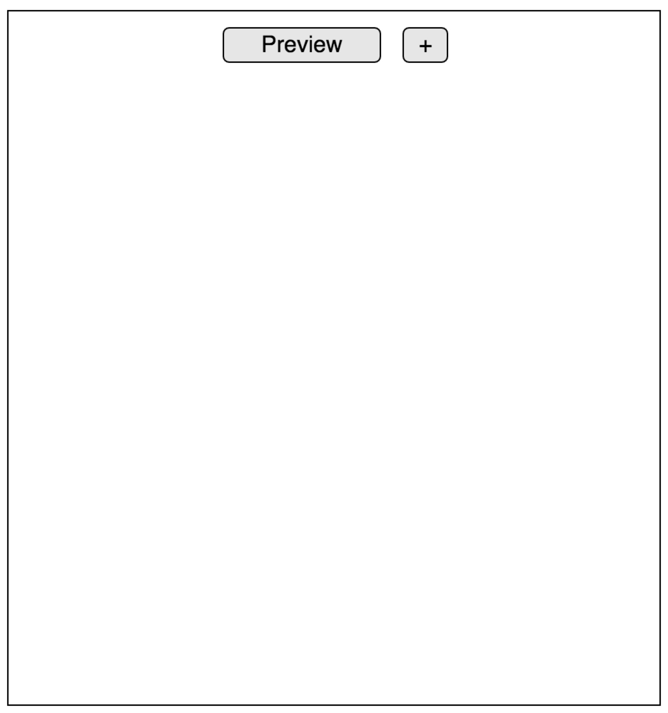
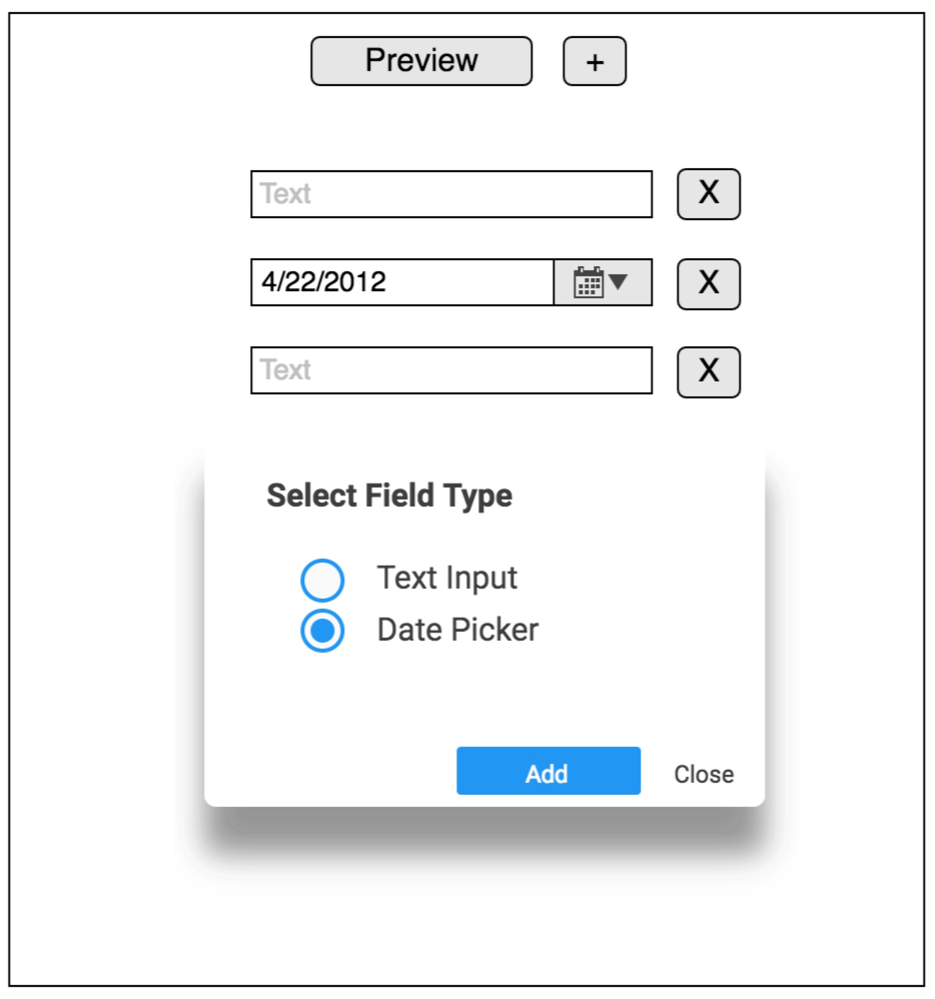
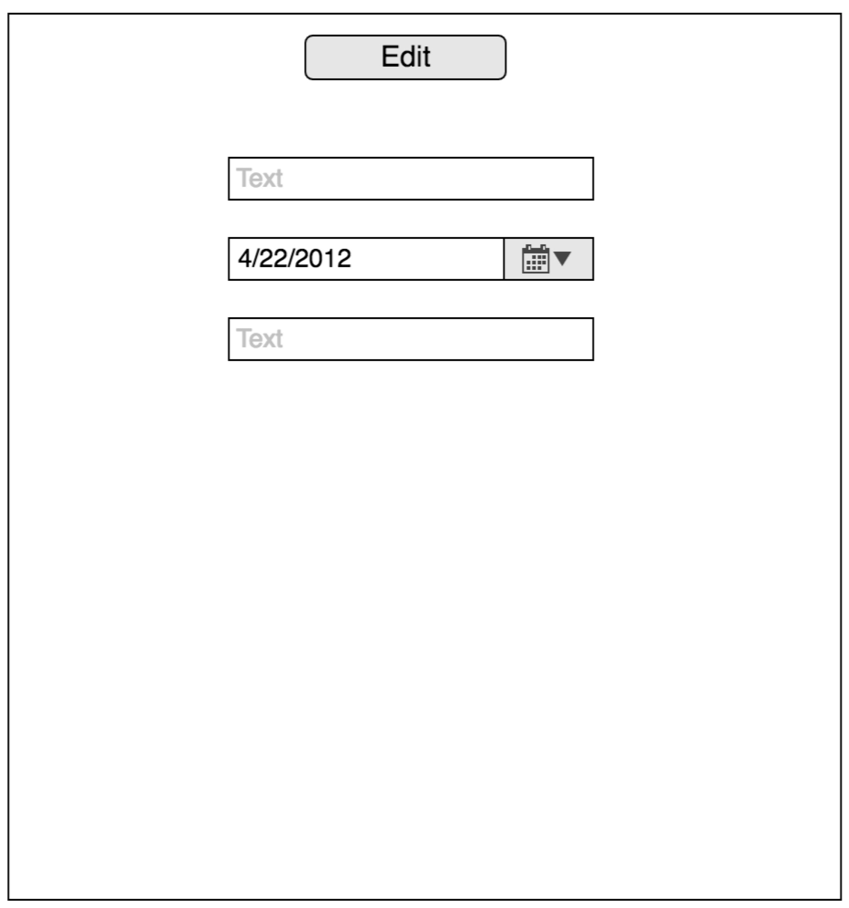

# Develop a Form Designer with React and Redux
## Business Requirement:
You need to write a form designer, which has these features:
* Select field type and add a field
* Remove field
* Preview

### Select field type and add a field
There should have an 'Add' button on the page. When you click on it, it will pop up a dialog for choosing the field type.



In the 'Choose Type' dialog, there are two types of field: Text and Date. You can choose your favarite type and click 'Add' button to add it on the design form or click 'Close' to close this dialog.



After you add a field type, the dialog will keep opening so that you can continue to choose and add more fields to the form.

### Remove field
There should have a 'Remove' button on the right of each field. When you click it, the field will be removed from the form.

### Preview
There should have a 'Preview' button on the page. When you click it, the button caption will change to 'Edit' so we can toggle between edit mode and previewmode. In the preview mode, you can either add a new field or remove a field.



## Practice Challenges:
* Understand and use the concept of 'store'
* Understand and use the concept of 'action'
* Understand and use concept of 'reducer'
* Design the proper folder structure fro Redux
* Distinguish the difference between App container and UI component
* Extract the state logic into Redux
* Integrate React and Redux

## Practice Requirements:
* Do tasking and break tasks in appropriate smallunits and commit code after completing each task
* Commit frequently with readable comment
* Coding with shortcuts

## Practice Output:
HTML and JavaScript (CSS is optional).

## Environment:
* HTML 5
* JavaScript ES6
* React 16.0.0
* React DOM 16.0.0
* jQuery UI 1.12.1
* React-redux 5.0.6

## How to Start:
Open your terminal, change into any path and clone this repository:
```
git clone repo_of_this_template
```
Install dependencies:
```
npm install
```

Start server:
```
npm start
```
It will automatically open [http://127.0.0.1:3000](http://127.0.0.1:3000) in your browser.

Open the project in your favorite editor, write JavaScript in `index.js` and HTML in `index.html`. Once completed, use `git` command below to set the `origin` of this repository:
```
 git remote set-url origin my_url
```
Then push your code into your own remote repository.

## Learning Resources:
1. [JavaScript Basics](https://developer.mozilla.org/en-US/docs/Learn/Getting_started_with_the_web/JavaScript_basics)
2. [JavaScript Code Camp](https://www.freecodecamp.org/challenges/comment-your-javascript-code)
3. [JavaScript Objects](https://www.w3schools.com/js/js_objects.asp)
4. [ECMAScript 6 Features](http://es6.ruanyifeng.com/)
5. [Install Node](https://github.com/creationix/nvm)
6. [Install NPM](https://github.com/npm/npm)
8. [Git Reference](https://git-scm.com/docs)
7. [React Tutorial](https://reactjs.org/tutorial/tutorial.html)
9. [Redux Tutorial](http://redux.js.org/docs/basics/)